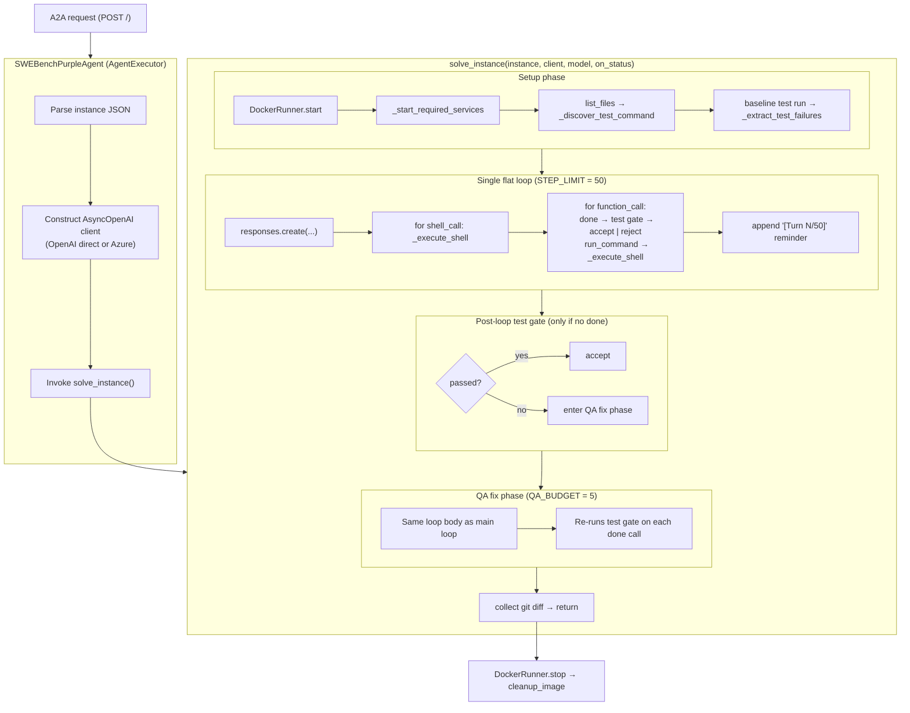
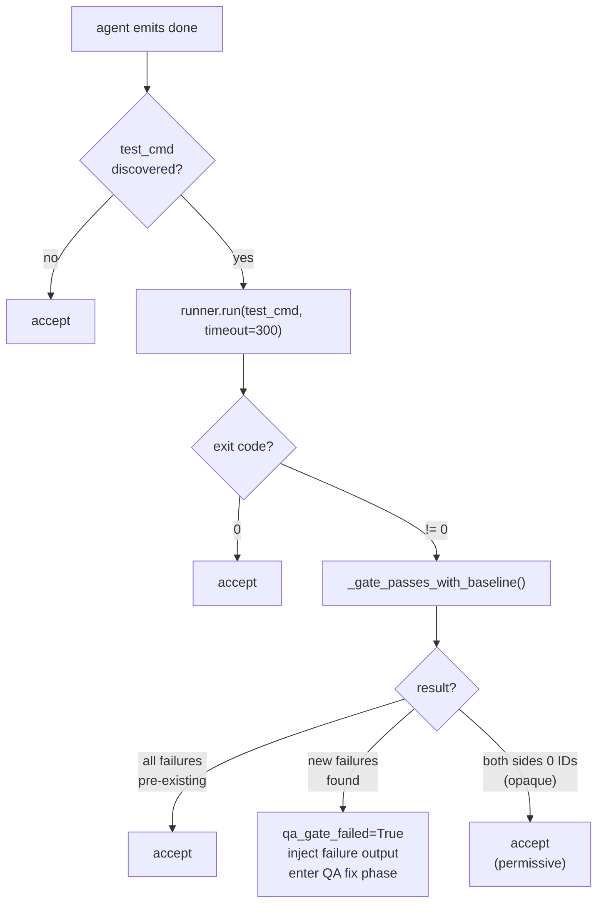

<!-- markdownlint-disable-file -->

# Purple Agent Architecture — `simple_loop` (log056-baseline)

Reference for the purple agent on branch `log056-baseline`.

This document describes **only** the simple_loop architecture as it
exists on `log056-baseline`. The post-baseline scaffolding
(multi-strategy solvers, prompt registry, providers ABC, distiller,
stuck detector, deterministic pipeline) lives on later branches and
is documented separately in
[`architecture-solver_refactor.md`](architecture-solver_refactor.md).
See [`architecture.md`](architecture.md) for the index.

## Contents

- [System overview](#system-overview)
- [Component diagram](#component-diagram)
- [File inventory](#file-inventory)
- [Request flow](#request-flow)
- [Inside `solve_instance`](#inside-solve_instance)
- [Test gate and QA fix phase](#test-gate-and-qa-fix-phase)
- [Model-aware prompts and tools](#model-aware-prompts-and-tools)
- [Caching strategy](#caching-strategy)
- [Docker container lifecycle](#docker-container-lifecycle)
- [Service auto-start](#service-auto-start)
- [Test command discovery](#test-command-discovery)
- [Configuration](#configuration)
- [Deployment](#deployment)
- [Known limitations](#known-limitations)

## System overview

The purple agent receives one SWE-bench instance at a time from the
green agent over A2A. For each instance it:

1. Pulls and starts a Docker container from the instance's image.
2. Auto-starts background services (Redis / MongoDB / PostgreSQL).
3. Probes the repository for a working test command (generic
   multi-framework detection).
4. Runs the baseline test suite once to capture pre-existing failures.
5. Selects a system prompt + tool set based on the model name.
6. Runs **a single flat agent loop** for up to `STEP_LIMIT=50` turns.
7. On `done`, runs a **baseline-aware test gate** that filters
   pre-existing failures before deciding pass/fail. If new failures
   exist, the loop continues for up to `QA_BUDGET=5` additional steps.
8. Classifies the outcome with **escalation flags** when the agent
   didn't succeed (no patch, QA exhausted, step limit without done).
9. Collects the working tree's git diff and returns it as an A2A
   artifact.

There are no strategies, no provider abstractions, no separate
prompt modules, no context distiller, and no patch-format converter.
Everything happens inline in `server.py`'s `solve_instance()`
coroutine.

## Component diagram

The following diagram depicts the components of the AgentWhetters SWE Bench Pro Simple Loop solver.



## File inventory

The purple agent is three Python files plus tests:

| File | Lines | Responsibility |
|---|---:|---|
| `src/purple/server.py` | 1891 | Module-level constants; system prompts; tool definitions; service / test-command / failure-extraction helpers; baseline-aware gate; escalation flags; `ConversationLogger`; the `solve_instance()` coroutine; `SWEBenchPurpleAgent` A2A executor; `prepare_agent_card()`; CLI `main()` |
| `src/purple/docker_runner.py` | 257 | `DockerRunner` — pull image, start container, run shell commands, read/write files via tar, apply patches, collect `git diff` (with binary/noise filtering) |
| `src/purple/__init__.py` | 0 | Package marker |
| `tests/test_baseline_gate.py` | 289 | Unit tests for `_extract_failure_ids`, `_gate_passes_with_baseline` |
| `tests/test_docker_runner.py` | 202 | Unit tests for `DockerRunner` diff filtering |

The Dockerfile copies just `src/`, `pyproject.toml`, `uv.lock`, and
`README.md` into the image and launches `uv run src/purple/server.py`.

## Request flow

1. Green agent posts an A2A `tasks/send` request whose first user
   message is a JSON-encoded SWE-bench instance.
2. `SWEBenchPurpleAgent.execute()` (in `server.py`) parses that
   message, builds an `AsyncOpenAI` client (Azure or OpenAI direct
   depending on env vars), and calls `solve_instance()`.
3. `solve_instance()` runs the loop above and returns a unified
   diff string.
4. `execute()` wraps the diff in a `TaskArtifactUpdateEvent` and
   completes the task.

`_make_openai_client()` in `server.py` selects:

- `AsyncAzureOpenAI` when `AZURE_OPENAI_ENDPOINT` is set; deployment
  name comes from `AZURE_OPENAI_DEPLOYMENT`, API version from
  `AZURE_OPENAI_API_VERSION`.
- `AsyncOpenAI` (with optional `OPENAI_BASE_URL`) otherwise.

## Inside `solve_instance`

`solve_instance()` is one ~490-line coroutine. Its phases:

| Phase | Lines (approx) | What it does |
|---|---:|---|
| Container start | ~620–640 | `DockerRunner.start()` resets to `base_commit` |
| Service start | ~640–650 | `_start_required_services()` brings up Redis / Mongo / Postgres if config files mention them |
| Repo overview | ~650–660 | `runner.list_files(".", max_depth=2)` truncated to 10 KB |
| Test discovery | ~660–680 | `_discover_test_command()` probes `package.json`, `pytest.ini`, `go.mod`, etc. |
| Baseline failures | ~680–700 | Runs the discovered command once and runs `_extract_test_failures()` on the output |
| Initial user message | ~700–720 | Repo header + file listing + truncated problem statement + truncated hints + test command + baseline failures |
| Conversation init | ~720–740 | `_get_system_prompt()` + `_get_tools()` chosen from the model name |
| **Main loop** | ~740–880 | `STEP_LIMIT=50` iterations of `client.responses.create` + tool dispatch |
| Post-loop gate | ~880–905 | Only fires when no `done` was called and the gate hasn't already failed |
| **QA fix phase** | ~905–1060 | `QA_BUDGET=5` extra iterations, identical loop body, re-runs test gate on `done` |
| Diff collection | ~1060–1080 | `runner.get_diff()`, log result, return |

The structure is a simple nested loop driven largely by the LLM. A permissive
baseline-aware test gate checks each `done` call; if the gate rejects, the QA
fix phase gives the agent up to `QA_BUDGET` additional turns to correct its
patch before the result is finalised. Supporting helpers (`_discover_test_command`,
`_gate_passes_with_baseline`, `_extract_failure_ids`, `ConversationLogger`, etc.)
are defined in `server.py` but the core control flow is one `solve_instance()`
coroutine with three loops sharing local state via closure.

## Test gate and QA fix phase

The baseline-aware test gate is the central scaffolding feature of
this branch.



After every gate verdict (pass or fail), a **shadow gate** (`_shadow_gate`) runs
a patch-scoped test command derived from the changed files for logging purposes.
The shadow gate result is recorded to the transcript but does not affect the
verdict. Separately, a **Go build check** (`_go_build_check`) runs
`go test -run=^$ -count=1 ./...` for Go repositories to catch compile failures
across all packages; this also does not alter the gate verdict but is logged.
```

### Baseline-aware gate logic

`_gate_passes_with_baseline(gate_exit, gate_output, baseline_exit, baseline_output)`:

1. Exit code 0 → pass unconditionally.
2. No baseline available or baseline exit 0 → fall back to raw exit
   code (fail).
3. Both failed → extract failure IDs from both outputs using
   `_extract_failure_ids()` and compute `new_failures = gate - baseline`.
4. If both sides yield 0 parsed IDs (opaque output — unrecognised
   format, configuration error exit code 4, etc.) → pass permissively
   rather than blocking the patch.
5. Otherwise: pass when `new_failures` is empty and gate IDs are non-empty.

### Multi-framework failure extraction

`_extract_failure_ids()` parses output from:

- **pytest**: `FAILED`, `RERUN`, `ERROR` lines
- **go test**: `--- FAIL:`, gocheck `FAIL:`, package-level `FAIL\t`
- **mocha/npm**: Numbered failures `1) suite > test:`
- **jest**: Covered by `FAIL` prefix parsing
- **Infrastructure**: `sh: N: cmd: not found`, `Fatal Python error`
- **Timeouts**: `[command timed out after Ns]`, coreutils timeout messages

### QA fix phase

The QA fix phase (entered only if the gate found new failures) is a
near-clone of the main loop body. It runs up to `QA_BUDGET=5` extra
LLM turns. On each `done` it re-runs the gate. On gate pass it
accepts; on gate fail it injects "DONE REJECTED — N steps remaining"
and keeps going.

Notes:

- The post-loop gate fires only when the agent ran out of `STEP_LIMIT`
  turns without calling `done` and the gate has not already failed
  earlier in this instance. If it passes, the patch is accepted.
- The QA fix phase re-uses the **same** `test_cmd` discovered at
  startup. There is no per-patch test selection.
- `QA_BUDGET=5` reflects that most QA recoveries happen within 3-5
  steps; longer budgets lead to flailing on unrecoverable cases.

## Model-aware prompts and tools

Both the system prompt and the tool set are chosen by a single
prefix check:

```python
_REASONING_MODEL_PREFIXES = ("gpt-5", "o1", "o3", "o4")

def _is_reasoning_model(model_name: str) -> bool:
    name = (model_name or "").lower()
    return any(name.startswith(p) for p in _REASONING_MODEL_PREFIXES)
```

Two paths:

| Path | Used by | System prompt | Tool set |
|---|---|---|---|
| **Reasoning** | gpt-5, o1, o3, o4 | `SYSTEM_PROMPT_REASONING` (inline in `server.py` lines 105-186) | `TOOLS_REASONING` — native `shell_call` tool |
| **Classic** | gpt-4o family | `SYSTEM_PROMPT_CLASSIC` (lines 187-253) | `TOOLS_CLASSIC` — `run_command` + `done` function-calling |

Both prompts are inlined in `server.py` as `textwrap.dedent("""...""")`
literals. There is no prompt registry, no per-provider override, no
prompt loader.

For reasoning models, the API request also enables:

- `include = ["reasoning.encrypted_content"]`
- `context_management = [{"type": "compaction", "compact_threshold": 200_000}]`
- `reasoning = {"effort": "high", "summary": "auto"}` (effort is hardcoded)
- `max_output_tokens = 16_000`

For classic models:

- `temperature = 0.0`
- `max_output_tokens = 4_096`

After each turn, the loop drops history before the most recent
`compaction` item (when present) to keep the prompt size bounded.

## Caching strategy

The agent achieves high token-cache hit rates through two mechanisms.

**Automatic prompt caching (OpenAI)**  
OpenAI automatically caches the longest repeated prefix of each
request. Because the system prompt and initial user message (repo
header, file listing, problem statement, baseline failures) are
assembled once at the start of each instance and never modified,
every subsequent turn re-uses that cached prefix. Cache savings scale
with session length: a 50-turn session with a large preamble recovers
the preamble cost many times over in cached reads. In practice,
sessions with stable preambles routinely exceed 90% cache hit rates.

**Server-side context compaction (reasoning models only)**  
For reasoning-class models the API request includes a
`context_management` directive with `type: compaction` at
`COMPACT_THRESHOLD = 200,000` tokens. When the conversation exceeds
this limit, the Responses API replaces older turns with a compressed
summary. After compaction, the loop discards local history before the
most recent `compaction` item to stay consistent with the server's
view. Keeping the system prompt and initial message at position 0
throughout the session preserves the stable cacheable prefix and
avoids unbounded context growth.

**Tracking**  
Cached token counts are reported in the `usage` field of each
Responses API reply. The agent accumulates `cumulative_cached_tokens`
across turns and includes it in the per-instance `result` JSONL
record, enabling per-run cache efficiency analysis.

## Docker container lifecycle

`DockerRunner` is a thin wrapper around docker-py:

| Method | Effect |
|---|---|
| `start()` | `images.pull`, fall back to local cache, create container with `entrypoint=/bin/bash -c "tail -f /dev/null"`, then `git checkout && git reset --hard <base_commit>` |
| `run(cmd, timeout=120)` | `container.exec_run(["timeout","-k","5","<N>s","bash","-c",cmd], workdir=/app, demux=True)`. Uses short-form `-k` for BusyBox compatibility (Alpine-based images like teleport). On expiry returns 124 (TERM) or 137 (KILL) and annotates `[command timed out after Ns]`. |
| `read_file(path, max_bytes)` | `head -c <max_bytes> <path>` |
| `write_file(path, content)` | tar-archive injection via `put_archive` |
| `list_files(path, max_depth)` | `find ... | head -500` |
| `apply_patch(patch)` | tar-inject `fix.patch` then `git apply -v` |
| `is_running()` | `container.reload()` then check `status == "running"`. Guards `get_diff()` against dead containers. |
| `get_diff()` | Checks `is_running()` first; if dead returns `""`. Otherwise runs `(git ls-files --others ... | grep -v -F '.swe_baseline_test_output.txt' | xargs -r git add -N) && git diff HEAD -- . ':!.swe_baseline_test_output.txt' > /tmp/_patch.diff ; git reset`, then extracts via `get_archive`. Excludes `.swe_baseline_test_output.txt` from both untracked file staging and the diff output to prevent baseline test noise from leaking into patches. |
| `stop()` | `container.stop(timeout=5)` then `remove(force=True)` |
| `cleanup_image()` | `images.remove(force=True)` to reclaim host disk |

REPO_DIR is hardcoded to `/app`.

## Service auto-start

`_start_required_services()` is a heuristic over a small set of
files:

- Redis: `grep -i redis` in `config.json`, `docker-compose.yml`,
  `docker-compose.yaml`, or `package.json`. If found and `redis-cli`
  ping fails, run `redis-server --daemonize yes`.
- MongoDB: same idea, run `mongod --fork --logpath /tmp/mongod.log`.
- PostgreSQL: same idea, run `pg_ctl start` or `pg_ctlcluster 14 main start`.

This handles NodeBB and similar repositories whose tests need
sidecars. It does not run on every instance — only when one of the
config files mentions the service.

## Test command discovery

`_discover_test_command()` is a deterministic probe in this fixed
order:

1. **Node.js** — read `package.json`. If `scripts.test` exists,
   verify `npm` is present via `which npm`; if so, return `npm test`.
   Similarly for `scripts.check` → `npm run check`.
2. **Python** — if `pytest.ini` or `setup.cfg` or `pyproject.toml`
   exists and `python -m pytest --version` works, return
   `python -m pytest --tb=short -q`. Else try `unittest discover`.
3. **Go** — if `go.mod` exists, return `go test ./...`.
4. **Make** — if Makefile has a `^test:` target, return `make test`.
5. **Rust** — if `Cargo.toml` exists, return `cargo test`.
6. **Ansible** — if `lib/ansible/` and `test/units/` directories
   exist and pytest is available, return
   `python -m pytest test/units/ --tb=short -q`.
7. **C/C++** — if `CMakeLists.txt` exists, return
   `cmake --build build --target test 2>/dev/null || make test`.
8. **Ruby** — if `Gemfile` mentions rspec or minitest, return
   `bundle exec rake test`.
9. Otherwise return `None`. The agent runs without a test gate.

Python test flags are intentionally minimal: `--tb=short -q` for
compact output formatting only. Flags that alter test selection or
plugin behaviour (`-rfE`, `-x`, `-p no:rerunfailures`) are avoided
because they interact badly with repo-specific conftest hooks and
plugins.

The discovered command runs against the entire suite, not against
the patch's blast radius.

For Go repositories, a compile-only check (`go test -run=^$ -count=1 ./...`)
runs alongside the test gate to catch build failures across all packages.

## Configuration

Module-level constants in `server.py`:

| Name | Value | Meaning |
|---|---:|---|
| `STEP_LIMIT` | 50 | Maximum LLM turns in the main loop |
| `QA_BUDGET` | 5 | Maximum additional turns in the QA fix phase |
| `TOOL_RESULT_LIMIT` | 30,000 | Truncation for tool output bodies |
| `COMMAND_TIMEOUT` | 300 | Timeout passed to `runner.run` for in-container commands; enforced via `timeout(1)` wrapper. |
| `TEST_FAILURE_EXTRACT_LIMIT` | 6,000 | Truncation for failure-summary injection |
| `LOG_DIR` | `Path("logs")` | Where `ConversationLogger` writes JSONL transcripts |
| `COMPACT_THRESHOLD` | 200,000 | Token threshold for the Responses API server-side compaction directive |

Environment variables read by `server.py`:

| Variable | Used for |
|---|---|
| `OPENAI_API_KEY` | OpenAI direct or Azure auth |
| `OPENAI_BASE_URL` | Optional override for OpenAI direct |
| `AZURE_OPENAI_ENDPOINT` | Switches client to AsyncAzureOpenAI |
| `AZURE_OPENAI_DEPLOYMENT` | Azure deployment name → becomes the model string |
| `AZURE_OPENAI_API_VERSION` | Azure API version |
| `OPENAI_MODEL` / `LLM_MODEL` | Model name (overridden by `AZURE_OPENAI_DEPLOYMENT` when set) |

There are **no** env knobs for `STEP_LIMIT`, `QA_BUDGET`,
`COMMAND_TIMEOUT`, reasoning effort, or system prompt. All three
are hardcoded in this build.

## Deployment

```dockerfile
FROM ghcr.io/astral-sh/uv:python3.13-bookworm
# install Docker CLI for sibling-container exec
COPY pyproject.toml uv.lock README.md ./
COPY src src
RUN uv sync --locked
ENTRYPOINT ["uv", "run", "src/purple/server.py"]
CMD ["--host", "0.0.0.0", "--port", "9022"]
EXPOSE 9022
```

The CI workflow at `.github/workflows/test-and-publish.yml` builds
this image, mounts the host docker socket so the running purple
agent can launch sibling eval containers, runs `pytest`, and pushes
to `ghcr.io` on success.

## Known limitations

These are the behaviours that the post-baseline scaffolding has
tried to address. They are **not** present in this branch.

1. ~~**Test gate is broad-suite only.**~~ Partially mitigated:
   baseline-aware gate filters pre-existing failures, reducing false
   rejects. But the discovered command still runs the entire suite,
   not patch-scoped tests.
2. ~~**No empty-patch guard.**~~ Fixed: `done` is rejected when
   `git diff` is empty in both the main loop and the QA phase. The
   agent receives `DONE REJECTED — no changes detected` and must
   make actual edits before re-signaling done.
3. ~~**`DockerRunner.run` ignores `timeout`.**~~ Fixed: commands
   are wrapped in coreutils `timeout -k 5 <secs>` (short-form
   for BusyBox compatibility) so a hung in-container command
   can no longer block the executor thread.
4. **Single LLM call per turn, no parallelism, limited retry.**
   A transient 5xx will fail the instance (no backoff). Content-filter
   rejections (`BadRequestError`) are caught and end the loop
   gracefully so the diff is still collected.
5. **No per-instance wall-clock deadline.** The agent can exceed 30 minutes on
   a single instance. On the AgentX AgentBeats leaderboard the grader kills
   instances after 30 minutes. Instances that consistently hit `STEP_LIMIT`
   at high reasoning effort (~40 s/step) are at risk of timeout.
   A configurable wall-clock cutoff is not yet implemented.
6. **Hardcoded reasoning effort.** `effort="high"` is baked in. No
   way to fall back to medium/low for cost or latency control.


